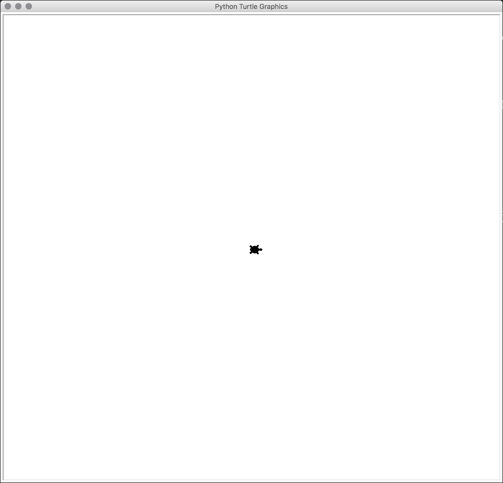

% Exercise Sheet 01 -- `print('Hello Python!')`

# Submission

By the end of this sheet you will have a number of different files to submit. In Stud.IP you will have a directory for your own group, please upload them there. It is easier for you if you just archive all files and upload your archive, but it is okay if you upload them one by one.

# Preamble

Throughout the course we will sometimes (especially in the beginning) refer to the command line or the terminal, and then again use them interchanged. Do not be disheartened! It is the same concept, but some operating systems call it one way and others the other. On Ubuntu you can open it up with the keyboard shortcut `Ctrl + Alt + T`. On MacOS press `Cmd + Space` and type `Terminal` to open it. On Windows, press the `Win + R` and type `cmd`, then hit return.

This is the basic "prompt" (... another term) where you can unleash the powers of your operating system (and break things!). Try `ls` on Mac/Linux or `dir` on Windows[^noworries]. You can navigate around with `cd` (go back up with `cd ..`).

[^noworries]: No worries, this won't break anything, it just shows the files of your current directory.


## Errors & Web Search

Although most exercises should be solvable with what we provide in the slides and cover in class, you will have problems solving some of the exercises -- that is by design. For example to solve the bonus exercise 1d) on this sheet, you might need to search around a little bit.


# Exercise 1: Your development environment

## Installing Python

Miniconda is a package management system which allows us to keep the
administrative overhead of installing Python to a minimum and similar for all
operating systems.

* Download Miniconda (Python 3.6) from
  [https://conda.io/miniconda.html](https://conda.io/miniconda.html).
* Install it. Make sure it is in your path[^path].
* Open your terminal / command line and run the following to install an
  IDE[^IDE] we will and two packages we might use:
    ```shell
    conda -y install spyder numpy matplotlib
    ```
* For stuff used in e.g. Neuroinformatics, Machine Learning, Computer Vision,
  or other classes, run additionally:
    ```shell
    conda -y install pip scipy pandas jupyter \
                     scikit-learn scikit-image
    ```

[^IDE]: Integrated Development Environment
[^path]: This is different for all operating systems. On Linux and MacOS it
    usually involves opening the file `~/.bashrc` and adding this line at
    the end: `export PATH="$PATH:~/miniconda3/bin"`. On Windows you have
    to go to your System settings and add `C:\Users\yourname\anaconda3`
    to the environment variable `Path` -- if you really have to do it
    manually, try searching the web or ask us for help (Best before Sunday
    night).


# Exercise 2: Hello you!

Open your terminal or command line. Type `python` and hit return. This will
start the python interpreter and you will see something like this:

```
Python 3.6.0 |Continuum Analytics, Inc.| (default, Dec 23 2016, 13:19:00)
[GCC 4.2.1 Compatible Apple LLVM 6.0 (clang-600.0.57)] on darwin
Type "help", "copyright", "credits" or "license" for more information.
>>>
```

Note that the second line (`[GCC ...] on darwin`) will most likely be
different, but even the first might differ from what you see above. As long as
you can see `Python 3.6.x` there and some `>>>`, you are all set.

Now type the following and hit return:

```{ .python .exec }
print("Hello Python!")
```

Modify the print statement you just typed so that it says each of the following:

1. `Hello [your name here]!`
1. `What's up?`
1. _Bonus_: `Are you "Monty"?`
1. _Bonus 2_: `Can't you just pretend you were "Monty"?`

Copy all of the successful statements (you may add your own) into an empty text
file and call it `hello.py`. This is one of the submission files. If you don't
get this to work, just upload a funny image and write the commands into the
Stud.IP file description. We will then discuss this in the feedback sessions.

You can exit the python interpreter by using `exit()` or hitting the control
key (`Ctrl`) and `d` (On Windows `Ctrl + Z` -- even though we write a capital
Z, you do not need the shift key!).[^eofeot]

[^eofeot]: You may find the key combination "control key and d" denoted as
  `Ctrl + D`, `^D`, `EOF`, or `EOT`. It means: "Here is the end of my input,
  you may exit", or in technical terms "end of file" or "end of transmission".
  Technically there is a difference between EOF (`^D`) and EOT (`^V` `^D`) (and
  the Windows `^Z`), but for us this does not matter much.


# Exercise 3: Turtles all the way down

In the late 20th century it became very popular to teach programming with a
turtle[^turtlewiki]. Those turtles were little robots that could move around --
check one out here:
[https://youtu.be/8wU6NdjTVTA](https://youtu.be/8wU6NdjTVTA). Did you notice
that it drew on the sheet of paper? No? Watch again then.

Since we can not afford to buy a turtle for everyone, Python allows us
to draw with a virtual turtle. Open your python interpreter again, as you did
in the previous exercise.

To use the turtle, you first have to tell python that we need it:

```python
import turtle
```

To show our turtle, use:

```python
turtle.shape('turtle')
```

You should see a window like this:



Now you can let your turtle move around and draw with the following commands:

```python
turtle.forward(100)
turtle.right(90)
turtle.backward(100)
turtle.left(90)
```

If you want to reset what your turtle drew, you can use `turtle.reset()`.

In Germany little kids learn to draw the *Haus vom Nikolaus* (St. Nicholas'
house) in one stroke. It looks like this:


Can you give your turtle commands to draw something like this?

Store your successful commands in a file `nicholas.py` for your submission.


[^turtlewiki]: Check
  [https://en.wikipedia.org/wiki/Turtle\_(robot)]()
  for more info. The concept is still popular today, although turtles are not
  enough anymore
  ([https://studio.code.org/s/frozen/stage/1/puzzle/1]()).
