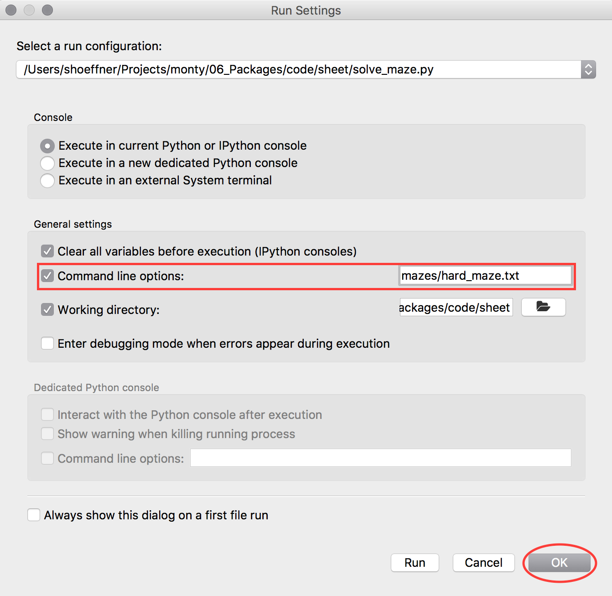

% Exercise Sheet 06 -- Python Packages

# Submission

By the end of this sheet you will have a number of different files to submit.
In Stud.IP you will have a directory for your own group, please upload them
there. It is easier for you if you just archive (preferably zip) all files and
upload your archive, but it is okay if you upload them one by one.


# Exercise 1: Mouse in the maze

An evil scientist trapped a mouse inside a maze. There's only one way for the
little mouse to get rescued: Find the hidden cheese. Its only tool: a piece of
chalk to mark where it went.

Help the mouse to find the cheese!

In the accompanying `*.zip` file there are the following files:

\dirtree{%
.1 06\textunderscore{}Packages.
.2 code.
.3 sheet.
.4 solve\textunderscore{}maze.py.
.4 mazesolver.
.5 io.py.
.5 solver.py.
.5 \textunderscore{}\textunderscore{}init\textunderscore{}\textunderscore{}.py.
.4 mazes.
.5 all\textunderscore{}directions\textunderscore{}maze.txt.
.5 hard\textunderscore{}maze.txt.
.5 impossible\textunderscore{}maze.txt.
.5 medium\textunderscore{}maze.txt.
.5 simple\textunderscore{}maze.txt.
}

Your task is to finish these three files such that the file `solve_maze.py` solves the maze for the little mouse:

- `mazesolver/solver.py`
- `mazesolver/io.py`
- `mazesolver/__init__.py`


You can find `# TODO instructions` in those files where you need to change the code. Note that the BONUS task (`store_maze`) is **not** necessary.

There are several mazes in the `mazes` directory. They are simple text files where the maze is layouts as a grid of numbers. Each number represents a type of field. The field types are:

0:
~ Empty space (The mouse can walk here)

1:
~ Mouse position (This is the starting point)

2:
~ Wall (The mouse can not go here)

3:
~ The cheese (When the mouse enters this field, it wins)

Here is one of those mazes:

```{ .changelog file=06_Packages/code/sheet/mazes/medium_maze.txt }
```


## Step by step task

Your first task is to assure the package is properly importable (finish `__init__.py`). Next finish the file reader for the maze files. The definition is found in the docstring:

```{ .python .exec wd=06_Packages/code/sheet }
import mazesolver.io
help(mazesolver.io.load_maze)
```

After you are able to read the files, solve the maze by following these instructions (a pseudocode can be found inside the docstring):

Recursively, if the maze is not solved (that means the cheese still exists), check if one of the four directions (up: one row up, i.e. row index - 1; down: row index + 1; left: column index - 1; right: column index + 1) is available to move to. If that's the case, move there and do the same from that space. If it is not available, try another direction. Once all directions are tried, return False. In case you find the cheese, return True.
Whenever you tried a direction and it was not successful, before returning from the function set the space back to being empty.

*Bonus*: If you want, try to store your solution (for this you also need to change the `solve_maze.py`) as well.


## Hints

- Make sure that you run the `solve_maze.py` from its directory.
- You can run the file with an argument! The easiest way to do so is to run it from the command line: `python solve_maze.py mazes/simple_maze.txt`[^py3] (you can adjust the maze file as needed). For running with spyder, you need to change the run configuration (Click on the menu tab `Run` and then `Configure...`. Search for *Command line options* and simply add the path there. Then hit *OK* to save it or *Run*). See below for an example.
- You can try the `simple_maze.txt` and `impossible_maze.txt` as tests, one is unsolvable and one just needs few steps.
- In case your code takes longer than about 5-10 seconds (on slow computers), you probably ran into an endless loop.
- You can safely assume that your mouse can not cross the boundary (i.e. you won't get `IndexError`s just because you want to try moving *down* at the last row) because there will be 2s around the whole board.



[^py3]: On some systems you might need to write `python3` instead of `python`.


## Submission

For the submission, archive (e.g. as a zip file) all these files:

\dirtree{%
.1 solve\textunderscore{}maze.py.
.1 mazesolver.
.2 io.py.
.2 solver.py.
.2 \textunderscore{}\textunderscore{}init\textunderscore{}\textunderscore{}.py.
.1 mazes.
.2 all\textunderscore{}directions\textunderscore{}maze.txt.
.2 hard\textunderscore{}maze.txt.
.2 impossible\textunderscore{}maze.txt.
.2 medium\textunderscore{}maze.txt.
.2 simple\textunderscore{}maze.txt.
}
