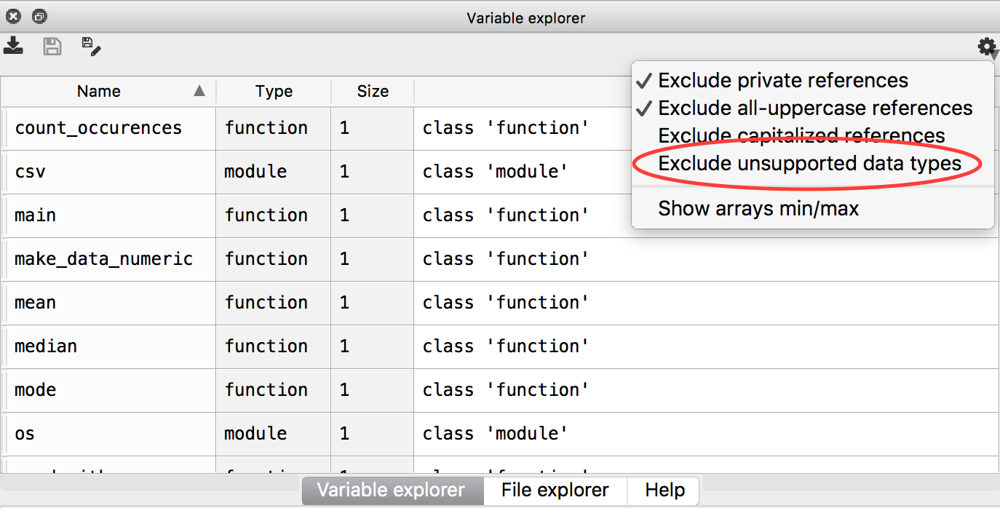

% Python Packages

---
header-includes:
    - \usepackage{dirtree}
---

# Homework issues

- Code written by others is always hard to read
- Usually complex code can't be read "from top to bottom"


# Try things out

Download the files accompanying the lecture slides to follow along today.
(Also your homework or our solutions from last week.)


# Organizing code

Or: How to write code that others (and my future me) understand?

- use sufficient documentation and comments
- use functions
- use modules


# Documentation and comments

Open spyder, run one of your files, e.g. the `iris_statistics.py`.

Type `help(functionname)` -- you can now see the documentation of that function.


# Function arguments

The `help` function takes a *function* as an argument. Wait, what? A function?

Try:

```{ .python .exec }
def fun():
    return 'Hello'
hello = fun
print(hello())
```

\note{
- Functions are just *objects* which also have a name, just like variables.
- The difference is that functions are *callable*, that means we can use `function(...)` to execute the code behind it.
}


# Functions as variables

\small

Spyder hides functions (and modules) in its variable explorer, but we can view them by unchecking *Exclude unsupported data types* in the menu.

\normalsize



\note{
You can call `help` with any of these! Even with modules!
}


# Import

```{ .python .exec }
import statistics

help(statistics)
```

\note{
In order to have a function or module available, we need to import it.
}

# TODO

# Python path

\small

We can check our python path, i.e. where python searches for modules:

\scriptsize

```{ .python }
import sys
print(sys.path)
```

```{ .python .hide .exec }
from pprint import pprint as print
import sys
print(sys.path)
```

\normalsize

\note{
We can import from anywhere inside our python path.

Notice the `''` (empty string) as the first element. That's basically "the
current working directory".

Python searches in all of these from the first to the last for modules you try
to import. As soon as it finds a match, that module is imported.

Of course, on your computers it will look different than what you see here.
}


# Writing our own modules

\scriptsize

```{ .python file=06_Packages/code/lecture/reader.py }
```

\normalsize

\note{
This is now a module containing one function.
}


# Using a module

```{ .python wd=06_Packages/code/lecture .exec file=06_Packages/code/lecture/printer.py }

import reader
data = reader.read_data('example.data')
print(data)
```

\note{
Using the `import` statement it is possible to employ functions from another
file.

Notice that we used `import reader` and not `import reader.py`! We are only
interested in the name, not in the type.

To call the function, we need to specify the module name and the function
name: The module name is just the name of the Python file: `module.function()`, here `reader.read_data(...)`.
}


# Reusing a function: directory structure

\scriptsize

```{ .python wd=06_Packages/code/lecture file=06_Packages/code/lecture/printer.py }
```

\normalsize

For this to work, our directory needs to have all files next to each other[^wd]:

\dirtree{%
.1 wd.
.2 reader.py.
.2 printer.py.
.2 example.data.
}

[^wd]: **wd** is the working directory, so where we `cd` to before running the code.


# A more complex directory structure

Consider the following directory tree:

\dirtree{%
.1 wd.
.2 lecture.
.3 reader.py.
.3 printer.py.
.3 example.data.
}

It is possible to `import`:

- `import lecture`. Allows accessing e.g. `lecture.reader.read_data(filename)`.
- `import lecture.reader`. Behaves similar to the above, but excludes the printer.

However, `lecture.printer` does not work! It uses `import reader`.

\note{
Imports are relative to the current directory and the directories inside the Python path.
}


# Import failure

\scriptsize

```{ .python .exec wd=06_Packages/code }
import lecture
import lecture.reader
import lecture.printer
```

\normalsize


# Your sixth homework


# The last slide


# References
