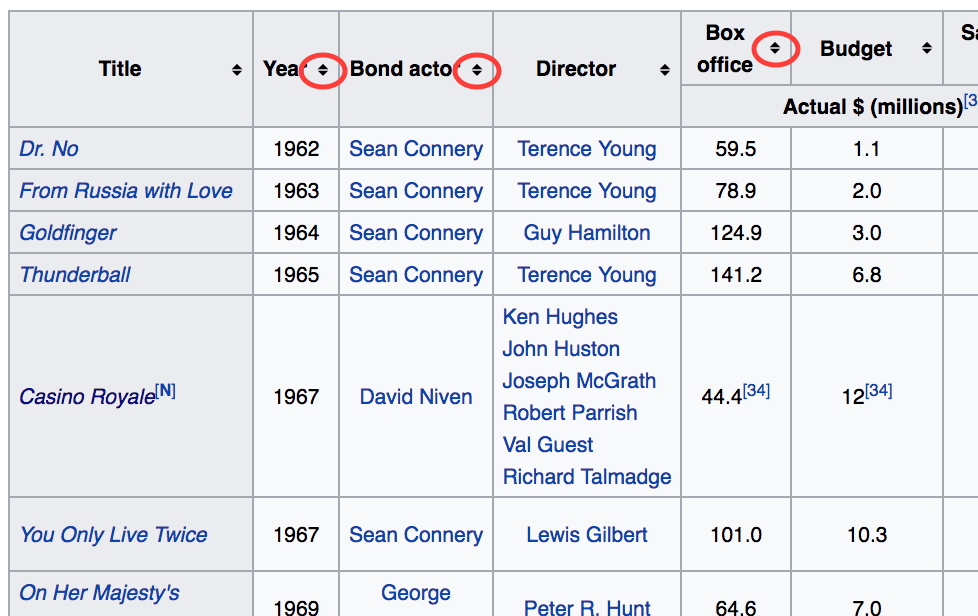

% Sorting and Object Oriented Programming


# Homework issues

- `__init__.py` is executed whenever you import that containing directory
- `import mazesolver.io` could have also been
    ```python
    from . import io
    ```
  , as it is slightly more flexible. We updated the solutions accordingly.

\note{`from . import io` means: "From the directory the current module is in
(`__init__.py`'s directory) import the module `io` (here `io.py`)"}


# Homework issues: Values and references

```{ .python .exec }
my_list = [1, 2, 3, 4]
my_value = my_list[2]  # assigns value from list
print(my_value)
my_value = 1
print(my_value)
print(my_list)  # list untouched
```

\note{
Python always copies values to new variables.

For simple types (int, float, etc.) Python copies values.

For complex types (lists, dictionaries, functions, instances (today)) Python copies the references.

A reference is just a hint to the place where the data is stored.
}


# Homework issues: Values and references

```{ .python .exec }
my_list = [1, 2, 3, 4]
my_other_list = my_list  # assigns reference
print(my_other_list)
my_other_list[2] = 1  # changes BOTH lists
print(my_other_list)
print(my_list)
```


# Homework issues: The given code is not set in stone

- When there's something like:
    ```{ .python }
    maze = [[]]
    return maze
    ```
  then it is mostly for syntactic purposes. Just change it, even if the `TODO`
  comes after.
- Same goes for `pass`.

\note{
`pass` is a `NOOP`, a "**No Op**eration" statement. Its only purpose is to make
unfinished code syntactically correct.
}


# Sorting

Why do we need to sort data?

- Searching is easier.
- Data is easier to understand.
- Rankings can be performed.
- ...


# Sort example

{ height=240px }


# Bubble sort interactive

[Bubble sort](https://www.youtube.com/watch?v=lyZQPjUT5B4)


# Bubble sort

```{ .python .exec }
bubblelist = [3, 0, 1, 8, 7, 2, 5, 4, 6, 9]
```


# Bubble sort

\scriptsize

```{ .python .exec file=07_SortingOOP/code/bubblesort.py}
```

\normalsize


# The last slide


# References
